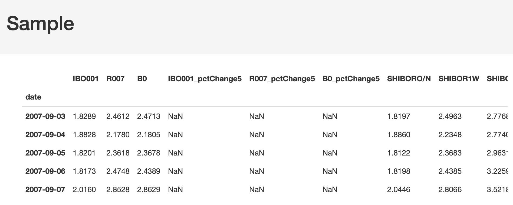
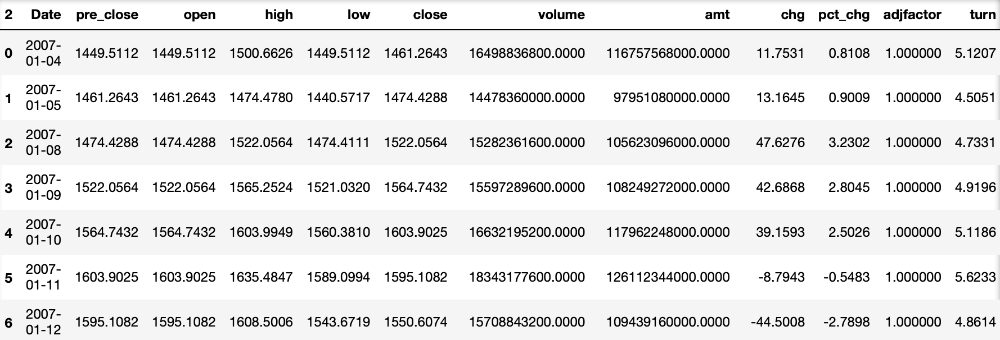

# PHBS_ML_for_quant_project
This is the repository for ML final project.

#### 0.Team Member

| Name                | Student ID | GitHub                                          |
| ------------------- | ---------- | ----------------------------------------------- |
| Yifan Hu/Evan       | 1901212691 | [eiahb3838ya](https://github.com/eiahb3838ya)   |
| Yuting Fang/Trista  | 1901212576 | [ytfang222](https://github.com/ytfang222)       |
| Zhihao Chen/Alfred  | 1901212567 | [AlfredChenZH](https://github.com/AlfredChenZH) |
| Zilei Wang/ Lorelei | 1901212645 | [LoreleiWong](https://github.com/LoreleiWong)   |

#### 1.Project Goal

Short-term market timing strategy based on boosting ML algos

#### 2.Data Selection

Dataset：According to the research report of Industrial Securities, we choose macroeconomic data([cleanedFactor.pkl](00 data/cleanedFactor.pkl)) plus OHLC data of windA([881001.csv](00 data/881001.csv)), and we add new data about index indicators, like DJI.GI. The data can be acquired from Wind Database directly（Denoted by D in the table. All factors are based on daily frequency data.

Sample:

#### 3.Data clean details

1. **Data fromats, structures**
   design a process for data cleaning. Remove NA values and make the format easy to slice according to time. Use dict and pandas dataframe to design our structure.
2. **Data Normalization**
   design a class for normalization work, which provides method including loading , calculating, saving data according to parameters given. At least implement two kinds of normalization, including min-max, z-score normalization.

#### 4. Explore and analysis data:

The description of dataset is in [report](07 report/inputDataReport.html).

1. **Visualiztion**
   to check if our data follow required statistical assumptions, we will visualize our data using seaborn or other tools. Draw a heat map to check the corr_coef of each factors. 

2. **Feature engineering** use tech indicator to build some factor like wq101.

3. **Feature selection**
   to check which factors have better prediction power. We will apply feature selection methods including Cross Entropy, information gain, gini coef, LASSO. Draw the graph for each factor accordingly 

   Now(naive，SVCL1，tree，varianceThreshold)

4. **Check the efficiency of features** (waiting to do) calculate the IC

5. **Decomposition** We can try PCA method to avoid dimension disaster, pick the top 5, 10 vectors as our feature to input.

#### 5. Single Model to classifier

do cv. turning the hyperpramaters.

total num is  7 base classifier models.(Logistic Regression, SVM, KNN, Naive Bayes, NeuralNetwork,Perceptron,Decision Tree)

print output roc,auc,etc

#### 6.Boosting Model to implement model

Random forest or XGBoost.

#### 7.Deep Learning algos to predict

Use sequential Model to make classifier. This case is not very suitable for deep learning algos because of small size of dataset.

#### 8.Evaluation overfitting framework

CSCV cross validation framework to evaluate the overfitting rate of each method.

#### Reference

meeting log url:https://hackmd.io/maqBPlJXQCuxeWJi7ga5AA?both
